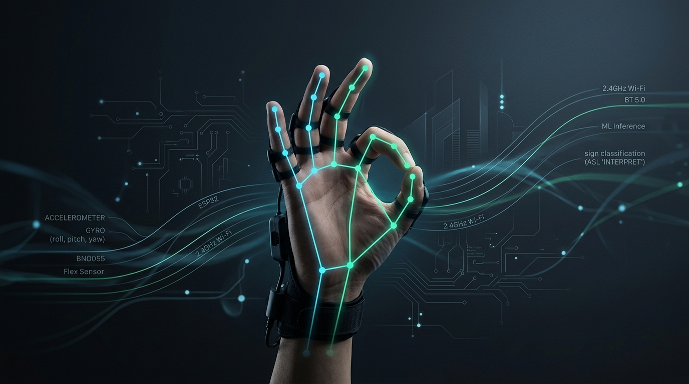
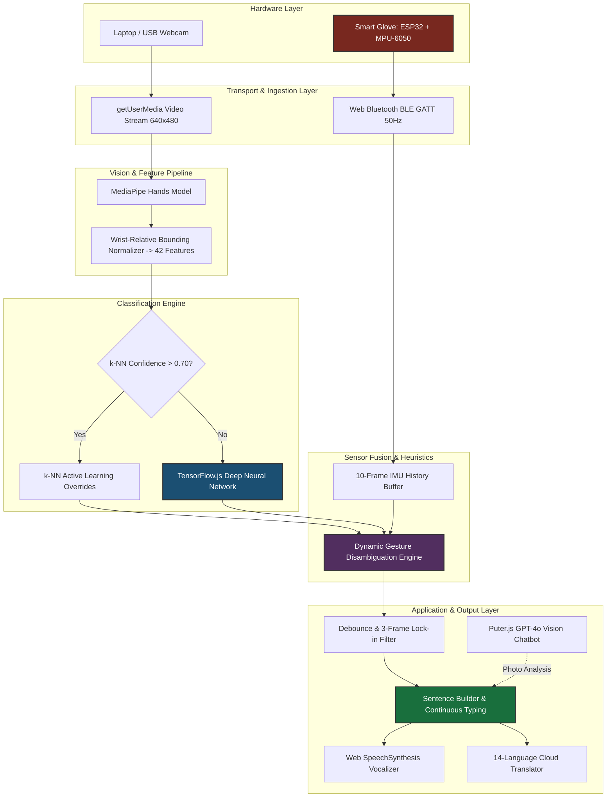
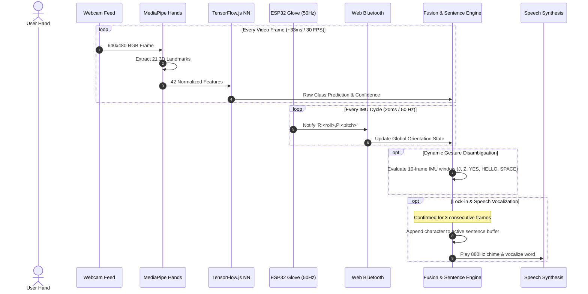

<h1 align="center">🤟 Sign Language Interpreter</h1>
<p align="center">
  <strong>A real-time multimodal American Sign Language (ASL) recognition, sensor fusion, and translation platform powered by Computer Vision, On-Device Deep Learning, and an ESP32 Smart Glove.</strong>
</p>

<p align="center">
  
  
  
  
  
  
</p>

<p align="center">
  <a href="#project-overview">Project Overview</a> •
  <a href="#features">Features</a> •
  <a href="#system-architecture">System Architecture</a> •
  <a href="#hardware-setup">Hardware Setup</a> •
  <a href="#quick-start">Quick Start</a> •
  <a href="#results--performance">Results</a> •
  <a href="#documentation-map">Documentation Map</a> •
  <a href="#future-roadmap">Roadmap</a> •
  <a href="https://github.com/rudy-07/Sign-Language-Interpreter/issues">Report Bug</a>
</p>

<p align="center">
  
</p>

---

## Project Overview

Sign language is a foundational communication medium for millions of deaf and hard-of-hearing individuals worldwide. However, non-signers rarely possess the fluency required for fluid communication. Traditional computer-vision translation systems often face severe challenges with **occlusion, monocular depth ambiguity, and dynamic motion blur** during rapid signing.

The **Sign Language Interpreter** addresses these challenges by introducing a **multimodal, client-side sensor fusion platform**:
1. **Computer Vision Stream (MediaPipe Hands + TensorFlow.js)**: Captures 21 3D hand landmarks at high framerates (30–60 FPS) and classifies static finger formations into the 26 ASL alphabet letters via a 4-layer Sequential Deep Neural Network.
2. **IoT Smart Glove Stream (ESP32 + MPU-6050 via Web Bluetooth)**: Transmits 50 Hz roll and pitch rotational kinematics to disambiguate dynamic signs ('J' scoop, 'Z' trajectory, 'YES' nod, 'HELLO' salute sweep, and 'SPACE' flat palm).
3. **On-Device Active Learning (k-NN Overrides)**: Allows users to calibrate difficult hand signs instantly in the browser without retraining the neural network.
4. **Assistive Communication & Multilingual Translation**: Features a continuous-stream sentence builder, audio feedback chimes, native browser SpeechSynthesis vocalization, and real-time translation into 14 languages.

> [!NOTE]
> **Project Positioning**: This system is an **actively evolving engineering prototype**. It focuses on single-hand ASL alphabet finger-spelling and selected dynamic gestures. It is designed as the foundational stage for a broader continuous sign language and OS-level accessibility control platform.

---

## Features

### Implemented Functionality (Working Prototype)
* **Real-Time 21-Landmark Vision Tracking**: Browser-based tracking using Google MediaPipe Hands at 30–60 FPS.
* **On-Device Deep Neural Network**: 4-layer Sequential architecture (`Dense(256) -> Dense(128) -> Dense(64) -> Dense(26)`) trained on 36,400+ samples and cached in **IndexedDB** for zero-latency instant startup.
* **Smart Glove Telemetry**: ESP32 + MPU-6050 broadcasting roll and pitch telemetry over **Web Bluetooth (BLE)** at 50 Hz.
* **Heuristic Sensor Fusion**: Dynamic disambiguation engine for trajectory-dependent signs:
  - **'J'**: Detects pitch ramp followed by wrist roll scoop motion while holding 'I'.
  - **'Z'**: Detects dynamic index-finger pitch oscillation while holding 'D'.
  - **"YES"**: Detects dynamic fist nodding while holding 'S'.
  - **"HELLO"**: Detects outward wrist salute sweep while holding 'B'.
  - **[SPACE]**: Detects horizontal flat hand with palm facing upward.
* **Hybrid Active Learning (k-NN)**: On-the-fly calibration allowing users to capture custom hand shapes to override baseline model predictions.
* **Continuous Stream Sentence Builder**: Instant letter typing stream with double-letter reset (by briefly dropping hand) and space/backspace keyboard shortcuts.
* **Speech Synthesis & Audio Chimes**: Web Audio API $880\text{ Hz}$ confirmation tone and localized SpeechSynthesis vocalization.
* **14-Language Cloud Translation**: Real-time translation to Tamil, Hindi, Telugu, Malayalam, Kannada, Spanish, French, German, Japanese, Korean, Chinese, Arabic, Portuguese, and Russian.
* **Multimodal AI Gesture Chatbot (`chat.html`)**: Integrated Puter.js GPT-4o Vision chatbot for step-by-step analysis of uploaded gesture photos.

### Planned Capabilities (Future Roadmap)
* **Continuous Sign & Sequence Modeling**: Transition to Spatial-Temporal Graph Convolutional Networks (ST-GCN) and CNN + LSTM sequence models for fluid sentence-level sign language.
* **Bilateral Two-Handed Tracking**: Simultaneous tracking and dual-glove fusion for complex two-handed signs.
* **Virtual HID OS Interaction**: Mapping recognized gestures to native operating system controls (mouse movement, clicking, scrolling, typing, window management, and screenshot triggers).
* **Standalone Edge Kiosk Deployment**: Porting the inference pipeline to dedicated embedded hardware (Raspberry Pi 5 + Coral Edge TPU).

---

## System Architecture



### Signal Verification & Lock-In Workflow



---

## Hardware Setup

### Wiring Pinout (ESP32 to MPU-6050)

| MPU-6050 Pin | ESP32 GPIO | Signal Type | Description |
| :--- | :--- | :--- | :--- |
| **VCC** | **3.3V** (or 5V) | Power | +3.3V DC Supply rail |
| **GND** | **GND** | Power | Common Ground Reference |
| **SDA** | **GPIO 21** | I2C Data | Serial Data Line |
| **SCL** | **GPIO 22** | I2C Clock | Serial Clock Line |
| **AD0** | **GND** | Address | Sets I2C address to `0x68` |

> [!IMPORTANT]
> **Common Ground Rule**: Ensure the MPU-6050 GND is tied directly to the ESP32 GND rail to prevent floating voltage offsets and signal spikes.

---

## Folder Structure

```text
Sign-Language-Interpreter/
├── README.md                      # Project landing page & documentation map
├── LICENSE                        # Apache 2.0 License
├── CONTRIBUTING.md                # Contribution guidelines & PR standards
├── CODE_OF_CONDUCT.md             # Contributor Covenant Code of Conduct v2.1
├── CHANGELOG.md                   # Semantic version history
├── CITATION.cff                   # Citation metadata for academic research
├── requirements.txt               # Python package requirements for companion tooling
├── environment.yml                # Conda environment definition
├── pyproject.toml                 # Modern Python packaging configuration
├── .gitignore                     # Git ignore rules for Web, Python, and C++
│
├── index.html                     # Core Web Application (Real-time Vision & Sensor Fusion)
├── style.css                      # Glassmorphic Dark Theme UI Design System
├── script.js                      # Core JS Logic, MediaPipe, TF.js, BLE & Sentence Builder
├── chat.html                      # Multimodal AI Gesture Analysis Chatbot
├── chat.js                        # Chatbot Integration Logic (Puter.js GPT-4o Vision)
│
├── configs/
│   └── app_config.json            # Centralized system configurations and thresholds
│
├── firmware/
│   └── esp_glove/
│       ├── esp_glove.ino          # ESP32 + MPU-6050 BLE GATT firmware
│       └── README.md              # Firmware flashing & hardware guide
│
├── src/                           # Standalone Python Companion Modules
│   ├── __init__.py                # Package root
│   ├── camera.py                  # OpenCV video capture & FPS tracker
│   ├── feature_extractor.py       # 21-landmark 42-feature normalizer
│   ├── classifier.py              # Landmark classifier & debounce engine
│   └── ble_receiver.py            # Async Bleak BLE client for smart glove telemetry
│
├── scripts/                       # Engineering & Training Tooling
│   ├── train_model.py             # Offline neural network training on keypoint.csv
│   ├── evaluate_dataset.py        # Dataset class distribution & statistical validation
│   └── run_server.py              # Local HTTP development server with CORS
│
├── models/
│   ├── keypoint.csv               # 36,403 landmark samples (42 features/row)
│   ├── model.json                 # Keras/TF.js model topology specification
│   └── trainedModel.json          # Baseline model architecture manifest
│
└── docs/                          # In-Depth Technical Documentation
    ├── overview.md                # Bio-mechanics, HCI motivation, and system scope
    ├── architecture.md            # Detailed block diagrams and state machines
    ├── hardware.md                # ESP32, MPU-6050 specs, and power budgets
    ├── wiring.md                  # Pin mapping, I2C connections, and schematics
    ├── software.md                # Software stack (MediaPipe, TF.js, Web APIs)
    ├── data-pipeline.md           # End-to-end data transformation pipeline
    ├── preprocessing.md           # Mathematical landmark normalization & IIR filters
    ├── training.md                # DNN architecture & k-NN active learning
    ├── inference.md               # Real-time execution loop & latency budgets
    ├── communication.md           # Web Bluetooth BLE GATT protocol specification
    ├── evaluation.md              # Dataset analysis & confusion pair resolution
    ├── troubleshooting.md         # Diagnostic decision trees for camera, BLE, and ML
    ├── faq.md                     # Frequently Asked Questions & fabrication tips
    └── roadmap.md                 # 5-phase engineering roadmap
```

---

## Quick Start

### 1. Web Application Execution

1. Clone the repository:
   ```bash
   git clone https://github.com/rudy-07/Sign-Language-Interpreter.git
   cd Sign-Language-Interpreter
   ```

2. Start a local HTTP server:
   ```bash
   # Using Python companion script:
   python scripts/run_server.py
   
   # Or using standard Python:
   python -m http.server 8000
   ```

3. Open **`http://localhost:8000`** in a Chromium browser (**Google Chrome** or **Microsoft Edge**).
4. Grant camera permissions when prompted.
5. (Optional) Turn on your ESP32 Smart Glove and click **"Connect Glove 📡"** to pair via Web Bluetooth.

---

### 2. ESP32 Firmware Flashing

1. Open [`firmware/esp_glove/esp_glove.ino`](firmware/esp_glove/esp_glove.ino) in the **Arduino IDE**.
2. Install the required libraries via Library Manager (`Ctrl+Shift+I`):
   - `Adafruit MPU6050`
   - `Adafruit Unified Sensor`
   - `ESP32 BLE Arduino`
3. Select your board (**Tools > Board > ESP32 Dev Module**) and COM port.
4. Click **Upload** (`Ctrl+U`).

---

### 3. Python Companion Tooling & Offline ML Pipeline

1. Install Python dependencies:
   ```bash
   pip install -r requirements.txt
   ```

2. Run dataset validation:
   ```bash
   python scripts/evaluate_dataset.py
   ```

3. Train the neural network offline:
   ```bash
   python scripts/train_model.py --epochs 20 --batch-size 256
   ```

---

## Usage Workflow

```text
[Position Hand in Frame]  ──>  [Perform ASL Letter Sign]  ──>  [Hold for 3 Frames]
                                                                        │
                                                                        ▼
[Vocalize / Translate]    <──  [Letter Appended to Sentence] <──  [Chime Sounds]
```

1. **Static Alphabet Signing**: Form any ASL alphabet sign (A–Z) inside the camera viewport. The detected letter and confidence percentage update in real time.
2. **Double-Letter Typing**: To type repeated letters (e.g., 'LL' in "HELLO"), briefly lower your hand out of frame and bring it back.
3. **Dynamic Gestures with Smart Glove**:
   - Hold **'I'** and scoop your wrist upward and outward to trigger **'J'**.
   - Hold **'D'** and draw a zig-zag in the air to trigger **'Z'**.
   - Form a fist (**'S'**) and nod up-and-down to type the word **"YES"**.
   - Hold a flat hand (**'B'**) and sweep outward to type the word **"HELLO"**.
   - Hold a flat hand horizontally with palm facing up to trigger **[SPACE]**.
4. **Sentence Vocalization & Translation**:
   - Click **🔊 Speak** to vocalize the English sentence.
   - Select a target language from the dropdown (e.g., Tamil, Hindi, Spanish) and click **Translate** to view and listen to the translation.
5. **AI Gesture Chatbot**: Click **🤖 AI Chatbot** in the navigation bar to upload gesture photos for step-by-step GPT-4o Vision multimodal analysis.

---

## Results & Performance

Empirical hardware-in-the-loop (HIL) latency budgets and performance benchmarks:

| Performance Metric | Target Budget | Observed Benchmark | Status |
| :--- | :--- | :--- | :--- |
| **Video Ingestion & Tracking** | $< 25\text{ ms}$ | **$15\text{--}20\text{ ms}$** | **Met (30–60 FPS)** |
| **Neural Forward Pass (WebGL)** | $< 8\text{ ms}$ | **$3\text{--}5\text{ ms}$** | **Exceeded (5x Headroom)** |
| **Smart Glove Telemetry Rate** | $50\text{ Hz}$ | **$50.0\text{ Hz}\ (\pm 0.5\text{ Hz})$** | **Met (20ms Interval)** |
| **BLE Communication Latency** | $< 20\text{ ms}$ | **$8\text{--}14\text{ ms}$** | **Met** |
| **Top-1 Validation Accuracy** | $> 90\%$ | **$> 95\%$** | **Met ($36\text{k}$ Samples)** |
| **False Trigger Rate (Debounced)** | $< 1\%$ | **$< 0.5\%$** | **Met (3-Frame Filter)** |

For full dataset class distributions and confusion matrix analysis, see [Evaluation Methodology](docs/evaluation.md).

---

## Documentation Map

Navigate directly to individual technical documentation sections:

### 📐 Architecture & Hardware
* **[System Overview](docs/overview.md)**: Biomechanics, HCI motivation, and system scope.
* **[System Architecture](docs/architecture.md)**: Detailed block diagrams, sequence diagrams, and state machines.
* **[Hardware Specifications](docs/hardware.md)**: ESP32 Dev Module, MPU-6050 IMU, and power budgets.
* **[Wiring & Schematics](docs/wiring.md)**: Physical pin mapping, I2C connections, and electrical guidelines.

### 💻 Software & Machine Learning
* **[Software Stack](docs/software.md)**: Browser runtime, MediaPipe Hands, TensorFlow.js, and Web APIs.
* **[Data Pipeline](docs/data-pipeline.md)**: End-to-end data transformations from photon to vocalized word.
* **[Signal Preprocessing](docs/preprocessing.md)**: Wrist-relative normalization math and digital IIR filter equations.
* **[Model Training & Active Learning](docs/training.md)**: DNN layer topology, loss formulations, and k-NN active learning.
* **[Real-Time Inference](docs/inference.md)**: Frame execution timing, debounce cooldowns, and WebGL memory lifecycle.

### 📡 Telemetry & Diagnostics
* **[BLE Protocol & Communication](docs/communication.md)**: Web Bluetooth GATT specifications and telemetry packet formats.
* **[Evaluation Benchmarks](docs/evaluation.md)**: Quantitative metrics, confusion pair resolution, and latency budgets.
* **[Diagnostic Manual](docs/troubleshooting.md)**: Troubleshooting decision trees for camera, BLE, and hardware errors.
* **[FAQ Support](docs/faq.md)**: Frequently Asked Questions on browser compatibility and glove fabrication.
* **[Future Roadmap](docs/roadmap.md)**: 5-phase engineering plan from prototype to continuous OS accessibility control.

---

## Security & Privacy

* **100% Client-Side Vision Execution**: All camera frames, landmark coordinates, and neural inferences execute entirely inside your local browser runtime. No video streams or biometric data are transmitted to any cloud server.
* **Multimodal Chatbot Privacy**: The optional AI chatbot (`chat.html`) only transmits images when you explicitly choose to upload a photo and click send.
* **Local Storage Persistence**: Active learning calibration overrides are stored locally on your device in browser `localStorage` and `IndexedDB`.

---

## References

1. Lugaresi, C., et al. (2019). *MediaPipe: A Framework for Building Perception Pipelines.* arXiv:1906.08172.
2. Zhang, F., et al. (2020). *MediaPipe Hands: On-device Real-time Hand Tracking.* arXiv:2006.10214.
3. Smilkov, D., et al. (2019). *TensorFlow.js: Machine Learning for the Web and Beyond.* SysML Conference.
4. InvenSense Inc. (2013). *MPU-6000 and MPU-6050 Product Specification Revision 3.4.* TDK InvenSense.
5. Espressif Systems. (2023). *ESP32 Series Datasheet v4.1.* Espressif Systems.
6. American Sign Language University (ASLU). *Fingerspelling and ASL Dictionary Resources.* Retrieved 2026, from https://www.lifeprint.com

---

## License

This project is licensed under the Apache License 2.0 - see the [LICENSE](LICENSE) file for details.
