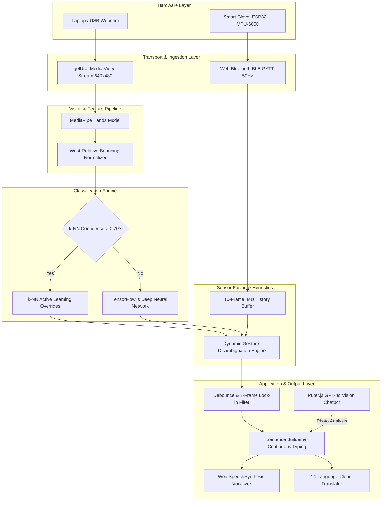
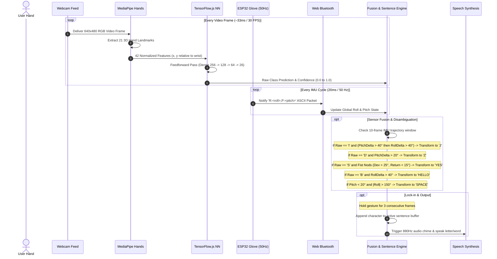
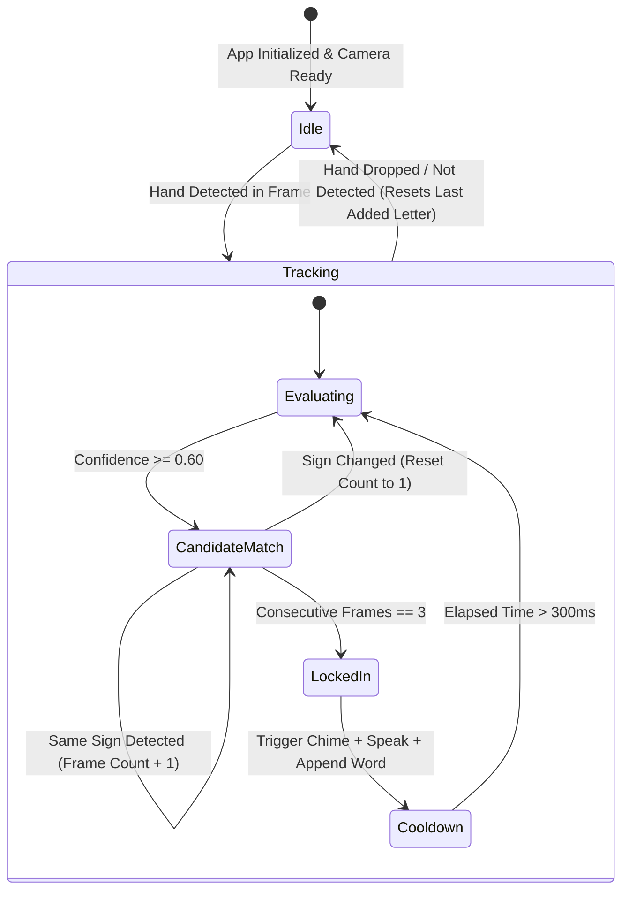

# System Architecture

The **Sign Language Interpreter** is engineered as a distributed, multi-tiered pipeline that couples embedded IoT firmware with high-performance browser-based computer vision and deep learning runtimes.

---

## High-Level Architectural Block Diagram

---

## Signal Processing & Inference Sequence

The following sequence diagram illustrates the frame-by-frame execution lifecycle from optical and inertial capture to translated vocalization:

---

## State Machine: Debounce, Lock-In, and Stream Handling

---

## Architectural Subsystems

### 1. Embedded Sensing Subsystem (`firmware/esp_glove/`)
- **Microcontroller**: Espressif ESP32 dual-core Xtensa LX6 microprocessor running at $240\text{ MHz}$.
- **Sensor**: InvenSense MPU-6050 6-axis MEMS accelerometer and gyroscope sampled via I2C at $100\text{ kHz}$.
- **On-Chip Preprocessing**: Digital low-pass filtering ($\alpha = 0.85$) and trigonometric tilt angle calculation (`atan2`).
- **Telemetry Server**: Custom Bluetooth Low Energy (BLE) GATT server broadcasting formatted ASCII string notifications.

### 2. Vision & Landmark Subsystem
- **Model**: Google MediaPipe Hands ML pipeline utilizing a two-stage detector/tracker architecture (Palm Detector followed by 3D Hand Landmark Model).
- **Coordinate Normalization**: Translates all 21 joints relative to landmark 0 (wrist) and scales by maximum coordinate magnitude to achieve scale- and translation-invariance.

### 3. Deep Learning Classifier Subsystem
- **Runtime**: TensorFlow.js WebGL/WebGPU-accelerated inference engine.
- **Topology**: 4-layer feedforward architecture with Batch Normalization and Dropout regularization.
- **Persistence**: IndexedDB zero-latency client caching (`indexeddb://asl-alphabet-model`).

### 4. Sensor Fusion & Active Learning Subsystem
- **k-Nearest Neighbors (k-NN)**: Active learning override layer enabling real-time local calibration for non-standard hand geometries.
- **Dynamic Heuristic Engine**: Circular buffer ($N=10$) analyzing angular derivatives ($\Delta \text{Roll}, \Delta \text{Pitch}$) to distinguish motion-dependent signs.

### 5. Assistive Output Subsystem
- **Web SpeechSynthesis API**: Vocalization with pitch and rate modulation.
- **Google Translate REST Endpoint**: Multilingual translation into 14 languages.
- **Puter.js GPT-4o Vision**: Multimodal conversational assistant for asynchronous gesture photo analysis.
