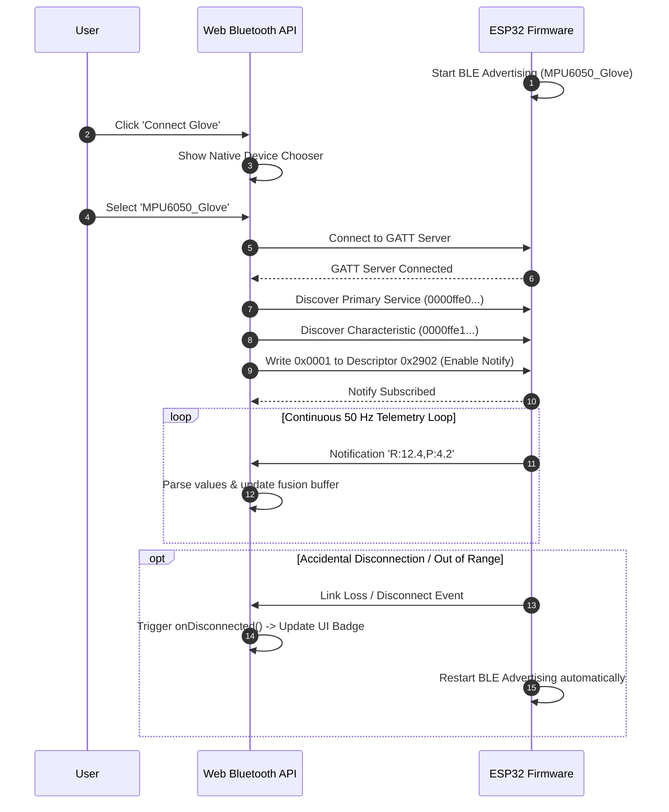

# Bluetooth Low Energy (BLE) Communication Protocol

This document defines the wireless telemetry protocol and GATT service architecture interfacing the **ESP32 Smart Glove** with the **Web Bluetooth client**.

---

## 1. BLE GATT Architecture

The communication model follows a standard **GATT Server / GATT Client** architecture:

- **GATT Server (Peripheral)**: ESP32 Microcontroller broadcasting IMU telemetry.
- **GATT Client (Central)**: Browser (via Web Bluetooth API) or Python runtime (via `bleak`).

```mermaid
flowchart LR
    subgraph ESP32 GATT Server
        DEV[Device Name: MPU6050_Glove]
        SRV[Service UUID: 0000ffe0-...]
        CHAR[Char UUID: 0000ffe1-... - READ | NOTIFY]
        DESC[BLE2902 Notification Descriptor]
    end

    subgraph Browser GATT Client
        REQ[navigator.bluetooth.requestDevice]
        CONN[gatt.connect]
        NOTIF[startNotifications & Event Listener]
    end

    DEV --> SRV --> CHAR --> DESC
    REQ --> CONN --> NOTIF <===>|50 Hz Notifications| CHAR
```

---

## 2. UUID & Characteristic Definitions

| Attribute | UUID | Value / Format | Description |
| :--- | :--- | :--- | :--- |
| **Advertised Device Name** | — | `MPU6050_Glove` | Filter used by `requestDevice` selector |
| **Custom Primary Service** | `0000ffe0-0000-1000-8000-00805f9b34fb` | — | Custom Service hosting orientation telemetry |
| **Telemetry Characteristic** | `0000ffe1-0000-1000-8000-00805f9b34fb` | String (UTF-8) | Read and Notify properties enabled |
| **Client Characteristic Config** | `0x2902` | `0x0001` (Notifications Enabled) | Standard 16-bit BLE descriptor for notify |

---

## 3. Telemetry Packet Specification

The ESP32 broadcasts updates as lightweight, human-readable ASCII string payloads at **$50\text{ Hz}$**:

$$\text{Payload Format: } \texttt{R:<roll\_deg>,P:<pitch\_deg>}$$

### Packet Field Definitions

| Field | Range | Units | Example | Description |
| :--- | :--- | :--- | :--- | :--- |
| `R:` (Roll) | $[-180.0, 180.0]$ | Degrees ($^\circ$) | `R:45.2` | Wrist tilt / forearm rotation around longitudinal axis |
| `,` | — | Delimiter | `,` | Separates roll and pitch tokens |
| `P:` (Pitch) | $[-90.0, 90.0]$ | Degrees ($^\circ$) | `P:-12.1` | Wrist flexion / extension angle |

*Full Packet Example*:
```text
R:23.4,P:-5.6
```

---

## 4. Connection Lifecycle & Auto-Reconnection Flow



---

## 5. Standalone Python BLE Client (`src/ble_receiver.py`)

For non-browser or desktop automation pipelines, Python connects directly to the ESP32 using the `bleak` library:

```python
import asyncio
from bleak import BleakClient
from src.ble_receiver import GloveBleReceiver, BLE_CHARACTERISTIC_UUID

async def main():
    receiver = GloveBleReceiver()
    receiver.set_callback(lambda r, p: print(f"Received Roll: {r:.1f}°, Pitch: {p:.1f}°"))

    # Connect to device address or discover by name
    async with BleakClient("XX:XX:XX:XX:XX:XX") as client:
        await client.start_notify(BLE_CHARACTERISTIC_UUID, receiver.notification_handler)
        await asyncio.sleep(30.0) # Listen for 30 seconds

if __name__ == "__main__":
    asyncio.run(main())
```
