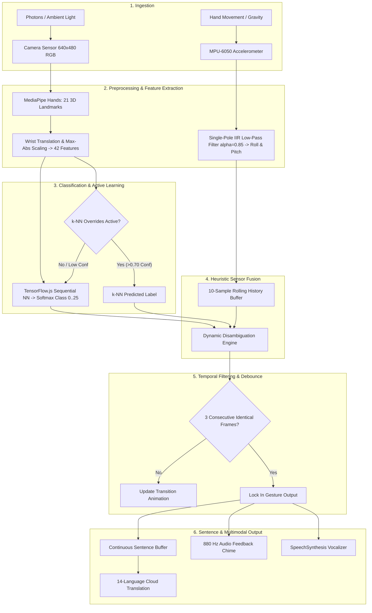

# Data Pipeline & Processing Flow

This document details the complete end-to-end data transformation pipeline—tracing raw physical inputs (optical photons and MEMS gravitational accelerations) through landmark extraction, mathematical normalization, neural classification, heuristic sensor fusion, and multi-modal output generation.

---

## End-to-End Data Pipeline Flowchart

---

## Pipeline Stage Breakdown

### Stage 1: Optical & Inertial Acquisition
- **Camera Stream**: Video frames are acquired via `navigator.mediaDevices.getUserMedia` at a native resolution of $640 \times 480$ pixels at $30\text{--}60\text{ FPS}$.
- **IMU Stream**: Accelerometer events are captured at $50\text{ Hz}$ ($20\text{ ms}$ periodic cycle) on the ESP32.

### Stage 2: Feature Normalization Math
Raw landmarks from MediaPipe are supplied in normalized viewport coordinates $(x_i, y_i) \in [0.0, 1.0]$.
1. **Wrist Subtraction**:
   $$x_i' = x_i - x_0, \quad y_i' = y_i - y_0 \quad \text{for } i \in [0, 20]$$
2. **Bounding Box Max-Absolute Scaling**:
   $$M = \max_{i} \left( \max(|x_i'|, |y_i'|) \right)$$
   $$\hat{x}_i = \frac{x_i'}{M}, \quad \hat{y}_i = \frac{y_i'}{M}$$
3. **Feature Vector**:
   $$\mathbf{f} = [\hat{x}_0, \hat{y}_0, \hat{x}_1, \hat{y}_1, \dots, \hat{x}_{20}, \hat{y}_{20}] \in [-1.0, 1.0]^{42}$$

### Stage 3: Neural Classification & k-NN Arbitrator
- The 42-element vector $\mathbf{f}$ is passed through the 4-layer Sequential network to compute output class distribution $\mathbf{p} = \text{Softmax}(\mathbf{z}) \in [0.0, 1.0]^{26}$.
- If k-NN active learning examples exist for user calibration, k-NN is queried with the 63-element 3D landmark tensor. If $C_{\text{knn}} > 0.70$, k-NN takes priority; otherwise, the neural network prediction is used.

### Stage 4: Sensor Fusion & Dynamic Motion Heuristics
When the vision layer outputs a candidate sign that has dynamic motion ambiguity, the 10-sample rolling IMU buffer is evaluated:
- **'I' $\to$ 'J'**: Detects sequential positive pitch ramp ($\Delta \text{Pitch}_1 > 40^\circ$) followed by wrist roll scoop ($\Delta \text{Roll}_2 > 40^\circ$).
- **'D' $\to$ 'Z'**: Detects dynamic pitch variation ($\Delta \text{Pitch} > 20^\circ$) tracing the 'Z' letter in air.
- **'S' $\to$ "YES"**: Detects nodding motion ($\text{Max Deviation} > 25^\circ$ with return delta $< 15^\circ$).
- **'B' $\to$ "HELLO"**: Detects salute sweep motion ($\Delta \text{Roll} > 40^\circ$).
- **[SPACE]**: Detects horizontal hand with palm facing upward ($\text{Pitch} < 20^\circ, |\text{Roll}| > 150^\circ$).

### Stage 5: Temporal Debounce & Lock-In
- A candidate sign must persist for **$3$ consecutive frames** to be locked in.
- A **$300\text{ ms}$ non-blocking cooldown** prevents double-registration while maintaining responsive continuous typing.
- Dropping the hand from the camera frame resets `lastAddedLetter`, enabling natural consecutive double-letter spelling (e.g., typing "HELLO").
