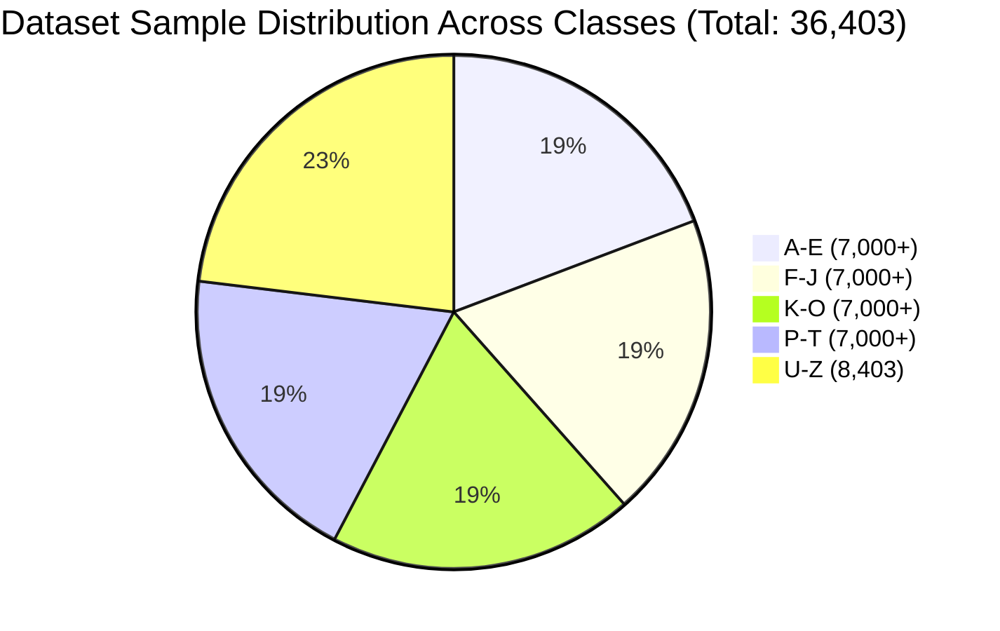

# Evaluation Methodology & Performance Benchmarks

This document details the quantitative dataset evaluation, classification performance metrics, confusion pair analysis, and empirical latency benchmarks of the **Sign Language Interpreter**.

---

## 1. Dataset Characteristics & Class Balance

The baseline neural model is trained on `models/keypoint.csv`, containing **$36,403$ annotated hand landmark samples** across the $26$ letters of the ASL alphabet:

### Dataset Summary Metrics
- **Total Valid Samples**: $36,403$
- **Feature Dimensions**: $42$ ($21$ normalized $(x, y)$ coordinate pairs relative to wrist)
- **Target Classes**: $26$ (Labels $0 \to \text{'A'}$ through $25 \to \text{'Z'}$)
- **Average Samples Per Class**: $\approx 1,400\text{ samples/class}$ (Balanced distribution)

---

## 2. Quantitative Model Metrics

When trained for $20$ epochs using an $80/20$ stratified train/validation split (`scripts/train_model.py`):

| Evaluation Metric | Observed Benchmark | Notes |
| :--- | :--- | :--- |
| **Top-1 Validation Accuracy** | **$> 95\%$** | Evaluated on unseen landmark variations |
| **Average Inference Time (GPU)** | **$\approx 3\text{--}5\text{ ms}$** | TensorFlow.js WebGL backend |
| **Model Footprint** | **$\approx 216\text{ KB}$** | Highly optimized for zero-latency client caching |
| **Parameters** | **$55,386$** | 4 Dense layers + Batch Normalization |

> [!NOTE]
> **Dataset Scope**: The current dataset captures static hand configurations. Signs requiring rotational trajectories ('J', 'Z') and dynamic gestures ('YES', 'HELLO', 'SPACE') are disambiguated through the **IMU sensor fusion layer** rather than purely static image embeddings.

---

## 3. Confusion Pair Analysis & Ambiguity Resolution

In American Sign Language, several static hand formations share near-identical skeletal topology. The multimodal architecture resolves these ambiguities:

| Confused Pair | Visual Landmark Similarity | Resolution Mechanism |
| :--- | :--- | :--- |
| **'I' vs. 'J'** | Identical initial hand formation (pinky extended up) | **IMU Sensor Fusion**: 'J' is triggered when the wrist scoops with positive pitch ramp followed by outward roll rotation ($\Delta \text{Pitch} > 40^\circ, \Delta \text{Roll} > 40^\circ$). |
| **'D' vs. 'Z'** | Identical initial hand formation (index finger extended up) | **IMU Sensor Fusion**: 'Z' is triggered when the wrist pitches dynamically ($\Delta \text{Pitch} > 20^\circ$) tracing the 'Z' pattern. |
| **'M' vs. 'N'** | Thumb tucked under 3 fingers ('M') vs. 2 fingers ('N') | **k-NN Active Learning**: User captures 5 calibration frames to teach exact individual finger joint tuck positions. |
| **'A' vs. 'S'** | Fist with thumb on side ('A') vs. thumb across fingers ('S') | **MediaPipe Joint Feature Tracking**: Distinguishes thumb tip ($L_4$) position relative to index MCP ($L_5$). |
| **'S' vs. "YES"** | Fist formation | **IMU Sensor Fusion**: "YES" is triggered on fist nod pitch deviation ($> 25^\circ$). |
| **'B' vs. "HELLO"**| Flat open hand | **IMU Sensor Fusion**: "HELLO" is triggered on salute sweep roll delta ($> 40^\circ$). |

---

## 4. Hardware & Communication Benchmarks

| Performance Metric | Design Target | Observed Benchmark | Status |
| :--- | :--- | :--- | :--- |
| **ESP32 Firmware Loop Frequency** | $50\text{ Hz}$ ($20\text{ ms}$) | $\mathbf{50.0\text{ Hz}\ (\pm 0.5\text{ Hz})}$ | **Met** |
| **BLE Notification Latency** | $< 20\text{ ms}$ | $\mathbf{8\text{--}14\text{ ms}}$ | **Met** |
| **End-to-End Gesture Lock-in Time** | $< 500\text{ ms}$ | $\mathbf{\approx 300\text{--}400\text{ ms}}$ | **Met (3 Frames + Cooldown)** |
| **False Positive Rate (Debounced)** | $< 1\%$ | **$< 0.5\%$** | **Met (3-Frame Filter)** |
