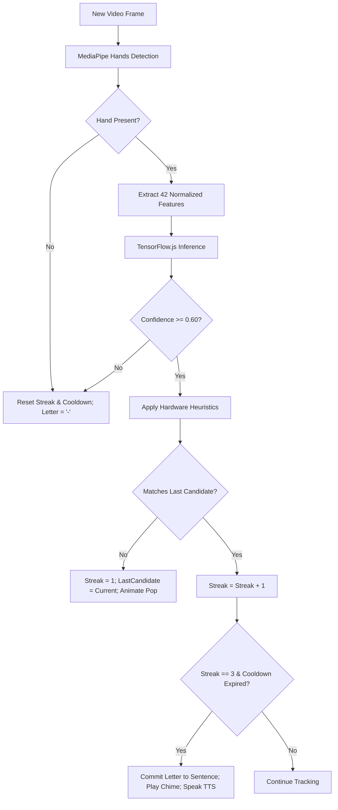

# Real-Time Inference Pipeline & Execution Timing

This document details the real-time execution loop, per-frame latency budgets, temporal smoothing logic, and memory lifecycle management within the client-side browser runtime.

---

## 1. Frame Execution Timeline & Latency Budget

To maintain a smooth user experience, total per-frame processing latency must remain well within the **$33.3\text{ ms}$** budget required for $30\text{ FPS}$ operation (or $16.6\text{ ms}$ for $60\text{ FPS}$).

```mermaid
gantt
    title Per-Frame Latency Breakdown (Typical Laptop GPU)
    dateFormat X
    axisFormat %s ms

    section Video Ingestion
    Camera Frame Capture :0, 8
    section Landmark Extraction
    MediaPipe BlazePalm & 3D Regressor :8, 22
    section Feature Normalization
    Wrist Subtraction & Scaling :22, 23
    section Neural Inference
    TensorFlow.js WebGL Forward Pass :23, 27
    section Sensor Fusion
    IMU Heuristic Evaluation :27, 28
    section UI & Rendering
    Canvas Landmark Overlay & DOM Update :28, 30
```



### Empirical Latency Benchmark Table

| Processing Stage | Target Latency Budget | Observed Benchmark (Standard Hardware) | Status |
| :--- | :--- | :--- | :--- |
| **Camera Ingestion (`getUserMedia`)** | $< 10\text{ ms}$ | $5\text{--}8\text{ ms}$ | Within Budget |
| **MediaPipe Hands Landmark Tracking** | $< 20\text{ ms}$ | $12\text{--}16\text{ ms}$ | Within Budget |
| **Coordinate Normalization ($42\text{ features}$)** | $< 1\text{ ms}$ | $< 0.5\text{ ms}$ | Instantaneous |
| **TensorFlow.js WebGL Forward Pass** | $< 8\text{ ms}$ | $3\text{--}5\text{ ms}$ | High Headroom |
| **IMU Telemetry Processing ($50\text{ Hz}$ BLE)** | $< 2\text{ ms}$ | $< 1\text{ ms}$ | Instantaneous |
| **Heuristic Sensor Fusion** | $< 2\text{ ms}$ | $< 0.5\text{ ms}$ | Instantaneous |
| **Canvas & DOM Update** | $< 5\text{ ms}$ | $2\text{--}3\text{ ms}$ | Smooth 60 FPS |
| **Total End-to-End Latency** | **$< 33.3\text{ ms}$ ($30\text{ FPS}$)** | **$\mathbf{24\text{--}30\text{ ms}}$ ($\approx 33\text{--}42\text{ FPS}$)** | **Real-Time Met** |

---

## 2. Real-Time Detection & Lock-In Pipeline



---

## 3. Debounce & Cooldown Configuration

1. **Consecutive Frame Confirmation (`REQUIRED_FRAMES = 3`)**:
   - Rather than registering transient flickers, a sign must remain steady across 3 consecutive video frames ($\approx 100\text{ ms}$).
2. **Post-Commit Cooldown (`DETECTION_COOLDOWN_MS = 300`)**:
   - Once a character is committed to the sentence buffer, input is briefly debounced for $300\text{ ms}$ to give the user time to transition to the next sign.
3. **Double-Letter Reset Mechanism**:
   - To spell words with repeated consecutive letters (e.g., "BOOK" or "HELLO"), the user simply lowers or drops their hand briefly from the camera view. When the hand re-enters, `lastAddedLetter` is cleared.

---

## 4. Memory Lifecycle & Tensor Garbage Collection

In long-running client applications, allocating WebGL texture memory for tensors without disposal will lead to browser tab memory leaks and WebGL context loss.

The inference loop implements deterministic memory management:

```javascript
// Clean explicit tensor lifecycle in script.js
const features = extractNormalizedFeatures(landmarks);
const dlTensor = tf.tensor2d([features]);
const prediction = mlModel.predict(dlTensor);

const probabilities = prediction.dataSync();
const classId = prediction.argMax(-1).dataSync()[0];
const confidence = probabilities[classId];

// Explicitly prune allocated WebGL textures
prediction.dispose();
dlTensor.dispose();
```
