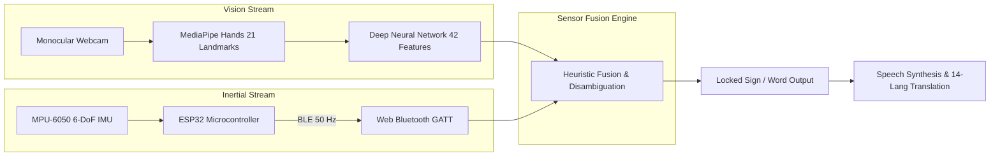

# System Overview

The **Sign Language Interpreter** is an open-source, real-time human-computer interaction (HCI) and assistive communication platform. It bridges the communication gap for deaf and hard-of-hearing communities by translating American Sign Language (ASL) gestures into digital text, synthesized speech, and multilingual translations in real time.

By combining browser-based computer vision (**MediaPipe Hands**), client-side on-device deep learning (**TensorFlow.js**), and low-latency IoT inertial sensing (**ESP32 + MPU-6050 Smart Glove via Web Bluetooth**), the platform achieves high-accuracy alphabet translation and dynamic gesture disambiguation without requiring dedicated cloud GPU clusters or specialized proprietary hardware.

---

## Why Multimodal Sign Language Recognition?

Sign language is a natural, highly nuanced visual-spatial language composed of:
1. **Static Hand Shapes**: Finger positions and joint flexures (e.g., ASL alphabet letters 'A', 'B', 'C').
2. **Dynamic Trajectories**: Continuous spatial movements and wrist re-orientations (e.g., the wrist scoop in 'J' or the zig-zag motion in 'Z').
3. **Orientation Semantics**: Roll and pitch tilt angles differentiating otherwise visually identical hand formations (e.g., flat palm-down vs. flat palm-up).

Purely vision-based systems frequently suffer from:
- **Depth and Angle Ambiguity**: Monocular 2D webcams lose spatial depth, making it difficult to differentiate subtle forward/backward wrist tilts.
- **Occlusion**: Fingers tucked behind the palm or facing away from the optical axis can lead to dropped landmark tracking.
- **Dynamic Motion Blur**: Fast continuous signing can produce blurred camera frames during rapid directional transitions.

Integrating an **ESP32 IMU Smart Glove** solves these challenges through **multimodal sensor fusion**:
- **Computer Vision** extracts fine-grained 21-joint skeletal hand topology.
- **Inertial Measurement (IMU)** supplies high-rate ($50\text{ Hz}$) 3-axis rotational telemetry (roll and pitch), resolving dynamic motion disambiguation and orientation triggers.

---

## Current Scope vs. Long-Term Vision

To ensure transparency, this repository explicitly separates what is implemented in the current prototype from future engineering goals:

| Aspect | Current Working Prototype | Planned Future Target |
| :--- | :--- | :--- |
| **Vocabulary** | 26 ASL static letters ('A'–'Z') + 5 fused gestures ('J', 'Z', 'YES', 'HELLO', 'SPACE') | Continuous ASL lexicon (500+ conversational words & idioms) |
| **Inference Mode** | Single-character stream with debounce lock-in | Continuous sentence-level sequence parsing (RNN/Transformer) |
| **Hardware** | Laptop Webcam + Single ESP32 MPU-6050 Glove | Dual-glove bilateral tracking + optional depth camera support |
| **Active Learning** | On-device k-NN override with LocalStorage persistence | Few-shot meta-learning model fine-tuning |
| **Application Layer** | Sentence builder, 14-language translation, Puter GPT-4o chatbot | OS-level virtual HID input (mouse control, keyboard typing) |

---

## Real-World Applications

1. **Assistive Communication & Daily Accessibility**: Provides instant verbalization for non-vocal signers in retail, healthcare, and educational environments.
2. **Interactive Sign Language Learning**: Real-time visual and audio feedback helps students practice accurate ASL finger spelling and gesture articulation.
3. **Touchless Human-Computer Interaction (HCI)**: Sterile surgical rooms, industrial manufacturing, and cleanroom environments where physical input devices are prohibited.
4. **Multilingual Accessibility**: Real-time translation of finger-spelled English sentences into 14 international and regional Indian languages (Tamil, Hindi, Telugu, Spanish, French, etc.).
