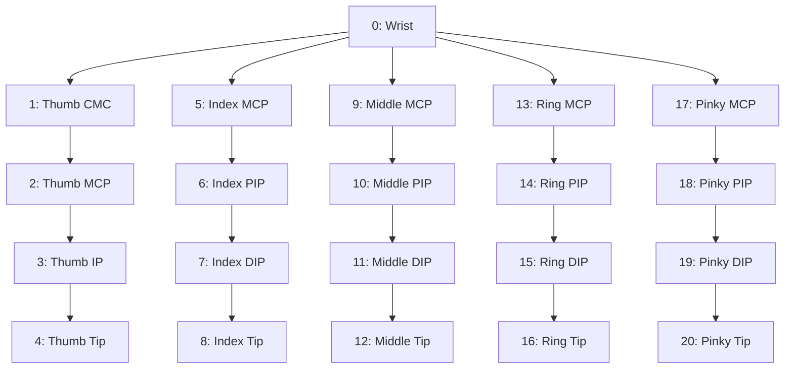

# Signal & Coordinate Preprocessing

This document outlines the mathematical and signal processing algorithms applied to both optical hand landmark streams and embedded IMU telemetry.

---

## 1. Vision Landmark Preprocessing

### MediaPipe Hand Keypoint Topology
MediaPipe extracts **21 3D landmarks** per detected hand:

| Joint Index | Description | Joint Index | Description |
| :--- | :--- | :--- | :--- |
| **0** | Wrist (Origin Reference) | **11–12** | Middle PIP, DIP, Tip |
| **1–4** | Thumb CMC, MCP, IP, Tip | **13–16** | Ring MCP, PIP, DIP, Tip |
| **5–8** | Index MCP, PIP, DIP, Tip | **17–20** | Pinky MCP, PIP, DIP, Tip |
| **9–10** | Middle MCP, Middle PIP | — | — |

---

### Coordinate Normalization Equations

Given raw landmark coordinates $\mathbf{L}_i = (x_i, y_i, z_i)$ for $i \in \{0, 1, \dots, 20\}$ from the detector:

#### 1. Translation Invariance (Centering on Wrist)
To ensure classification is invariant to where the hand is positioned inside the camera frame, the wrist joint ($\mathbf{L}_0$) is defined as the coordinate origin:
$$\Delta x_i = x_i - x_0, \quad \Delta y_i = y_i - y_0 \quad \forall i \in \{0, 1, \dots, 20\}$$

#### 2. Scale Invariance (Bounding Box Normalization)
To ensure classification is invariant to the hand's distance from the camera lens, features are scaled by the maximum coordinate distance from the origin:
$$M = \max_{i \in \{0, \dots, 20\}} \left( \max\left( |\Delta x_i|, |\Delta y_i| \right) \right)$$

If $M = 0$ (degenerate zero-area detection), $M \leftarrow 1.0$.

Normalized 2D coordinates are computed as:
$$\hat{x}_i = \frac{\Delta x_i}{M}, \quad \hat{y}_i = \frac{\Delta y_i}{M} \quad \implies \hat{x}_i, \hat{y}_i \in [-1.0, 1.0]$$

The final feature vector $\mathbf{f} \in \mathbb{R}^{42}$ is constructed by interleaving:
$$\mathbf{f} = \left[ \hat{x}_0, \hat{y}_0, \hat{x}_1, \hat{y}_1, \dots, \hat{x}_{20}, \hat{y}_{20} \right]$$

---

## 2. Inertial Telemetry Preprocessing (ESP32)

### Tilt Angle Estimation via Accelerometer
Gravitational acceleration components measured by the MPU-6050 are converted to Euler angles (Roll and Pitch) via 2-argument arc-tangent trigonometry:

$$\text{Roll} (\phi) = \text{atan2}(a_x, a_z) \times \frac{180}{\pi}$$

$$\text{Pitch} (\theta) = \text{atan2}\left(a_y, \sqrt{a_x^2 + a_z^2}\right) \times \frac{180}{\pi}$$

### Single-Pole IIR Low-Pass Filter
To eliminate high-frequency jitter and muscular tremor from the raw accelerometer readings, a digital single-pole Infinite Impulse Response (IIR) filter is applied on-chip at $50\text{ Hz}$:

$$\phi_t = \alpha \cdot \phi_{t-1} + (1 - \alpha) \cdot \phi_{\text{raw}}$$
$$\theta_t = \alpha \cdot \theta_{t-1} + (1 - \alpha) \cdot \theta_{\text{raw}}$$

Where the smoothing constant $\alpha = 0.85$.

#### Filter Cutoff Frequency ($\mathbf{f_c}$)
Given loop sampling rate $f_s = 50\text{ Hz}$ ($\Delta t = 0.02\text{ s}$):
$$\tau = \frac{\alpha \cdot \Delta t}{1 - \alpha} = \frac{0.85 \times 0.02}{0.15} \approx 0.1133\text{ s}$$
$$f_c = \frac{1}{2\pi \tau} \approx \mathbf{1.40\text{ Hz}}$$

*Result*: The filter strongly attenuates mechanical vibration frequencies above $1.4\text{ Hz}$ while maintaining instantaneous responsiveness to deliberate human hand gestures.

### Range Clamping & Angle Wrapping
$$\theta = \text{clamp}(\theta, -90^\circ, 90^\circ)$$
$$\text{If } \phi > 180^\circ \implies \phi \leftarrow \phi - 360^\circ; \quad \text{If } \phi < -180^\circ \implies \phi \leftarrow \phi + 360^\circ$$
