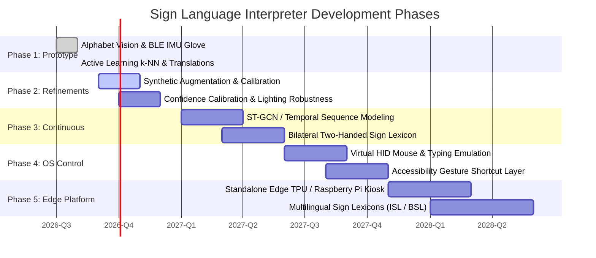
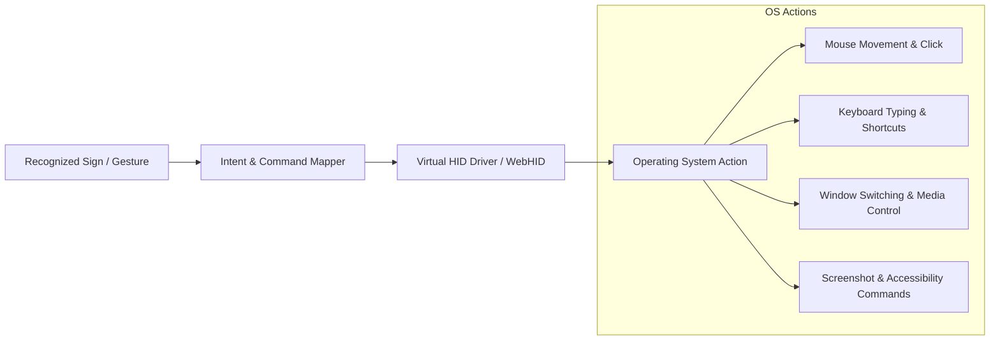

# Engineering Roadmap & Future Milestones

This document outlines the phased engineering roadmap for the **Sign Language Interpreter**, charting the progression from the current working prototype to a full-featured, continuous, accessible human-computer interaction platform.

---

## Roadmap Overview

---

## Detailed Phase Breakdown

### Phase 1 — Current Working Prototype (Completed)
- [x] **21-Landmark Vision Tracking**: Browser-based MediaPipe Hands at 30–60 FPS.
- [x] **On-Device Neural Inference**: 4-layer Sequential DNN with IndexedDB persistent caching.
- [x] **Smart Glove Telemetry**: ESP32 + MPU-6050 BLE GATT server streaming at $50\text{ Hz}$.
- [x] **Dynamic Heuristic Fusion**: Motion disambiguation for 'J', 'Z', 'YES', 'HELLO', 'SPACE'.
- [x] **Active Learning Overrides**: On-device k-NN calibration for user-specific hand shapes.
- [x] **Sentence Builder & Vocalizer**: Continuous typing stream, audio chime, and Web SpeechSynthesis.
- [x] **Multilingual Translation**: Real-time translation to 14 languages.
- [x] **Multimodal AI Chatbot**: Puter.js GPT-4o Vision photo analysis interface.

---

### Phase 2 — Dataset & Model Robustness (In Progress)
- [ ] **Synthetic 3D Augmentation**: Augment dataset with 3D rotations, perspective warping, and joint jittering.
- [ ] **Lighting & Background Invariance**: Add contrast adaptive histogram equalization (CLAHE) to improve landmark detection in low-light environments.
- [ ] **Confidence Calibration**: Implement temperature scaling on softmax logits to prevent overconfident false positives.
- [ ] **Multi-User Profile Management**: Allow multiple signers to save and load personalized calibration profiles.

---

### Phase 3 — Continuous Sign Language & Temporal Modeling
- [ ] **Spatial-Temporal Graph Convolutional Networks (ST-GCN)**: Transition from static frame classification to continuous joint graph sequence modeling.
- [ ] **CNN + LSTM / Transformer Temporal Pipeline**: Model dynamic sign transitions and continuous sentence construction.
- [ ] **Bilateral Two-Handed Tracking**: Enable simultaneous dual-hand tracking for complex ASL signs.
- [ ] **Grammar & Context Decoder**: Implement n-gram language models and beam search to correct finger-spelling typos automatically.

---

### Phase 4 — OS-Level Accessibility Control (Virtual HID)
Transform recognized signs and gestures into native operating system input commands:

- [ ] **Virtual Cursor Control**: Map hand roll/pitch to mouse cursor coordinates.
- [ ] **Click & Scroll Gestures**: Pinch gestures for left click, double click, and fluid scroll.
- [ ] **Global Shortcut Triggering**: Execute system shortcuts (e.g., screenshot, mute, switch workspace).

---

### Phase 5 — Edge Hardware & Multilingual Expansion
- [ ] **Embedded Edge Deployment**: Port inference to standalone edge hardware (e.g., Raspberry Pi 5 + Coral Edge TPU).
- [ ] **Multilingual Sign Languages**: Expand beyond ASL to Indian Sign Language (ISL), British Sign Language (BSL), and French Sign Language (LSF).
- [ ] **Low-Power Bluetooth 5.0 Custom PCB**: Design a miniaturized custom flex-PCB with integrated IMU and LiPo charging for ergonomic all-day wear.
