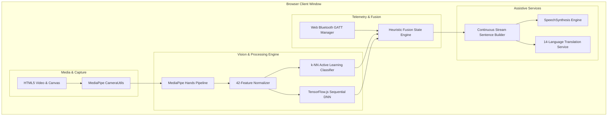

# Software Architecture & Technology Stack

The **Sign Language Interpreter** is engineered as a modern, zero-install, client-side web application paired with an embedded C++ firmware layer and Python companion engineering tooling.

---

## Technology Stack Overview

| Layer | Technology / Library | Version | Purpose |
| :--- | :--- | :--- | :--- |
| **Frontend UI** | HTML5 / Vanilla Modern CSS3 | Standard | Glassmorphic, responsive, high-framerate UI |
| **Client Scripting** | Vanilla JavaScript (ES2022+) | Modern ES | Event loop, DOM rendering, audio/speech logic |
| **Hand Landmark Detection** | Google MediaPipe Hands | `@mediapipe/hands` | 21 3D hand keypoint extraction at 30–60 FPS |
| **Deep Learning Runtime** | TensorFlow.js | `tfjs@latest` | WebGL-accelerated client-side neural inference |
| **Active Learning** | TF.js k-NN Classifier | `@tensorflow-models/knn-classifier` | Instant on-device calibration and sign overrides |
| **Hardware Communication** | Web Bluetooth API | W3C Standard | Low-latency wireless BLE GATT connection |
| **Audio Feedback** | Web Audio API | Standard | Synthetic $880\text{ Hz}$ sine wave confirmation chime |
| **Speech Synthesis** | Web SpeechSynthesis API | Standard | Native localized text-to-speech vocalization |
| **Translation Engine** | Google Translate REST API | Client GTX | Real-time sentence translation to 14 languages |
| **Multimodal Chatbot** | Puter.js + GPT-4o Vision | `v2` | Multimodal photo-based gesture analysis |
| **Embedded Firmware** | C++ / Arduino Framework | ESP32 Core 2.0+ | Non-blocking sensor polling & BLE GATT server |
| **Python Companion Suite** | Python 3.9+ / NumPy / scikit-learn | 3.10+ | Dataset validation, offline training, local dev server |

---

## Software Component Responsibilities

---

## Deep Learning Model Lifecycle

1. **Cold Start & IndexedDB Cache Check**:
   On page load, `buildAndTrainModel()` checks for a pre-cached model at `indexeddb://asl-alphabet-model`.
   - **Cache Hit**: Instant load ($\approx 50\text{ ms}$), immediately ready for inference.
   - **Cache Miss**: Automatically fetches `models/keypoint.csv` ($36,403$ samples), compiles the Sequential architecture, trains for $20$ epochs on-device, caches the result in IndexedDB, and transitions to inference mode.
2. **WebGL Acceleration**: TensorFlow.js delegates all tensor operations (matrix multiplications, convolutions, activations) directly to the host GPU shaders via WebGL 2.0, achieving per-frame inference latencies under $5\text{ ms}$.
3. **Memory Management**: Intermediate tensors in the active loop are systematically pruned via `.dispose()` to eliminate memory leaks and garbage collection stutters.

---

## Browser Compatibility Matrix

| Feature | Google Chrome | Microsoft Edge | Opera | Mozilla Firefox | Apple Safari |
| :--- | :---: | :---: | :---: | :---: | :---: |
| **Webcam (`getUserMedia`)** | Supported | Supported | Supported | Supported | Supported |
| **WebGL 2.0 (TensorFlow.js)** | Supported | Supported | Supported | Supported | Supported |
| **Web Bluetooth API** | Supported | Supported | Supported | Unsupported | Unsupported |
| **Web SpeechSynthesis API** | Supported | Supported | Supported | Supported | Supported |
| **Overall Status** | **Full (Recommended)** | **Full (Recommended)** | **Full** | Vision Only (No BLE) | Vision Only (No BLE) |
