# Model Architecture, Training & Active Learning

This document describes the deep neural network architecture, loss formulations, on-device browser training with IndexedDB persistence, offline Python reproducibility, and the hybrid active learning (k-NN) calibration engine.

---

## 1. Deep Neural Network Architecture

The classification model is a 4-layer Sequential Deep Neural Network engineered for high accuracy and ultra-low computational latency on client devices:

```mermaid
graph LR
    IN[Input: 42 Features] --> D1[Dense 256 + ReLU]
    D1 --> BN1[Batch Normalization]
    BN1 --> DO1[Dropout 30%]
    DO1 --> D2[Dense 128 + ReLU]
    D2 --> BN2[Batch Normalization]
    BN2 --> DO2[Dropout 20%]
    DO2 --> D3[Dense 64 + ReLU]
    D3 --> OUT[Dense 26 + Softmax]
    OUT --> PREDICT[Output Class Probabilities]
```



### Layer Specification Table

| Layer # | Layer Type | Output Shape | Activation | Regularization / Params |
| :--- | :--- | :--- | :--- | :--- |
| **0** | `InputLayer` | `(None, 42)` | — | 42 normalized hand coordinates |
| **1** | `Dense` | `(None, 256)` | ReLU | $42 \times 256 + 256 = 11,008$ parameters |
| **2** | `BatchNormalization` | `(None, 256)` | — | Normalizes layer activations ($1,024$ params) |
| **3** | `Dropout` | `(None, 256)` | — | $30\%$ rate to prevent overfitting |
| **4** | `Dense` | `(None, 128)` | ReLU | $256 \times 128 + 128 = 32,896$ parameters |
| **5** | `BatchNormalization` | `(None, 128)` | — | Normalizes layer activations ($512$ params) |
| **6** | `Dropout` | `(None, 128)` | — | $20\%$ rate |
| **7** | `Dense` | `(None, 64)` | ReLU | $128 \times 64 + 64 = 8,256$ parameters |
| **8** | `Dense` (Output) | `(None, 26)` | Softmax | $64 \times 26 + 26 = 1,690$ parameters |
| **Total** | — | — | — | **$55,386$ trainable parameters ($\approx 216\text{ KB}$)** |

---

## 2. Training Formulation & Optimization

### Categorical Cross-Entropy Loss
Given ground truth one-hot vector $\mathbf{y} \in \{0, 1\}^{26}$ and predicted probability vector $\hat{\mathbf{y}} \in (0, 1)^{26}$:
$$\mathcal{L}_{\text{CCE}}(\mathbf{y}, \hat{\mathbf{y}}) = -\sum_{k=0}^{25} y_k \log(\hat{y}_k)$$

### Optimization Hyperparameters
- **Optimizer**: Adam ($\eta = 0.001, \beta_1 = 0.9, \beta_2 = 0.999, \epsilon = 10^{-7}$)
- **Batch Size**: $256$
- **Epochs**: $20$
- **Dataset Size**: $36,403$ samples in `models/keypoint.csv`

---

## 3. On-Device Browser Training & IndexedDB Caching

When running in the browser:
1. `tf.loadLayersModel('indexeddb://asl-alphabet-model')` is queried.
2. If absent, the application asynchronously parses `models/keypoint.csv`, compiles the model, and executes `model.fit()` with WebGL GPU acceleration.
3. Upon completion, `model.save('indexeddb://asl-alphabet-model')` stores model weights in the browser's persistent IndexedDB storage.
4. Subsequent launches load instantly ($\approx 50\text{ ms}$) without repeating the training process.

---

## 4. Offline Python Training Pipeline

To retrain or benchmark the model offline in a Python environment:

```bash
# Run dataset integrity evaluation
python scripts/evaluate_dataset.py

# Train Keras model and export model.json
python scripts/train_model.py --epochs 20 --batch-size 256 --val-split 0.2
```

---

## 5. Hybrid Active Learning: k-NN Calibration Overrides

Users with atypical hand morphology or lighting conditions that degrade default neural network accuracy can teach custom hand poses on-the-fly:

1. **Feature Vector**: 3D wrist-relative landmark tensor $\in \mathbb{R}^{63}$ ($21 \times 3$).
2. **Classifier**: `@tensorflow-models/knn-classifier` instance.
3. **Arbitration Logic**:
   - The user selects a letter (e.g., 'E') and captures 5–10 frames.
   - During live inference, k-NN confidence $C_{\text{knn}}$ is calculated:
     $$\text{Final Class} = \begin{cases} \hat{y}_{\text{knn}} & \text{if } C_{\text{knn}} > 0.70 \\ \hat{y}_{\text{DNN}} & \text{otherwise} \end{cases}$$
4. **Persistence**: k-NN dataset weights and exemplar counts can be exported to and imported from `localStorage` (`asl_knn_dataset`).
