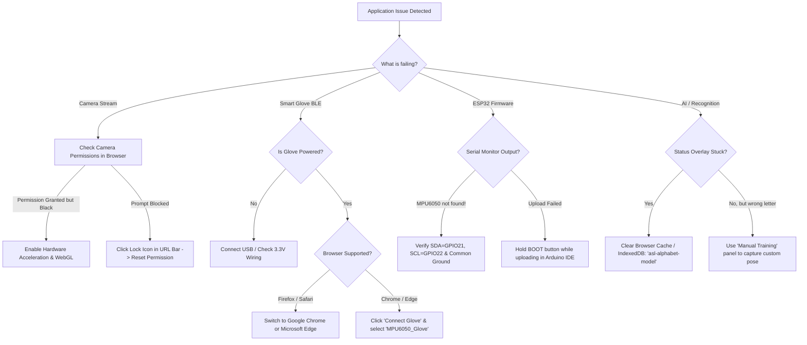

# Troubleshooting & Diagnostic Manual

This manual provides structured diagnostic decision trees and step-by-step solutions for resolving common camera, Web Bluetooth, hardware, and machine learning runtime issues.

---

## 1. Diagnostic Decision Flowchart

---

## 2. Detailed Issue Resolution Reference

### A. Camera & Video Pipeline

| Symptom | Probable Cause | Corrective Action |
| :--- | :--- | :--- |
| **"Error accessing camera. Please grant permission."** | Browser permission blocked or camera in use by another app | 1. Close other apps using camera (Zoom, Teams, etc.). 2. Click the **Lock / Tune icon** in the browser address bar $\to$ toggle **Camera** to **Allow** $\to$ refresh. |
| **Low FPS ($< 15\text{ FPS}$)** | WebGL hardware acceleration disabled | 1. Open `chrome://settings/system` $\to$ enable **"Use graphics acceleration when available"**. 2. Check `chrome://gpu` to verify WebGL 2.0 status. |
| **Flipped / Mirrored Video** | Mirroring configuration | By default, the canvas is mirrored horizontally (`scale(-1, 1)`) so gestures match natural mirror movements. |

---

### B. Web Bluetooth & Smart Glove

| Symptom | Probable Cause | Corrective Action |
| :--- | :--- | :--- |
| **"Web Bluetooth not supported"** | Running in unsupported browser (Firefox, Safari) | The W3C Web Bluetooth specification is currently supported in **Google Chrome**, **Microsoft Edge**, and **Opera**. Switch to a Chromium browser. |
| **"MPU6050_Glove" not appearing in chooser** | ESP32 not advertising or already connected to another device | 1. Power cycle the ESP32. 2. Ensure ESP32 is within $5\text{ meters}$. 3. Open Arduino Serial Monitor at 9600 baud to verify `"BLE Ready: MPU6050_Glove"`. |
| **Intermittent Disconnections** | Weak BLE signal or power rail drop | Ensure stable USB power. Avoid placing the ESP32 antenna directly against metal surfaces. |

---

### C. ESP32 & MPU-6050 Hardware

| Symptom | Probable Cause | Corrective Action |
| :--- | :--- | :--- |
| **Serial shows: `"MPU6050 not found!"`** | Loose I2C wiring or incorrect pins | 1. Verify SDA $\to$ **GPIO 21** and SCL $\to$ **GPIO 22**. 2. Verify VCC is connected to **3.3V** and GND to **GND**. 3. Run an I2C scanner sketch to confirm address `0x68`. |
| **Erratic Roll/Pitch Jumps ($> 100^\circ$ spikes)** | Floating ground reference | Ensure the MPU-6050 GND pin is firmly tied to the ESP32 GND rail. A floating ground creates severe voltage offsets. |
| **Arduino IDE: `"Failed to connect to ESP32: Timed out"`** | ESP32 bootloader not triggered | Press and hold the **BOOT (IO0)** button on the ESP32 board when `Connecting........_____` appears in the IDE console until upload starts. |

---

### D. Audio & Speech Synthesis

| Symptom | Probable Cause | Corrective Action |
| :--- | :--- | :--- |
| **No audio chime or speech vocalization** | Browser autoplay audio policy | Browsers block audio playback until the user interacts with the page. Click any button on the page once to unlock the Web Audio Context. |
| **Foreign language voice sounds in English** | Local language speech pack not installed on OS | Install the relevant OS speech voice pack (e.g., Tamil, Hindi, Spanish) via **Windows Settings > Time & Language > Speech**. |
