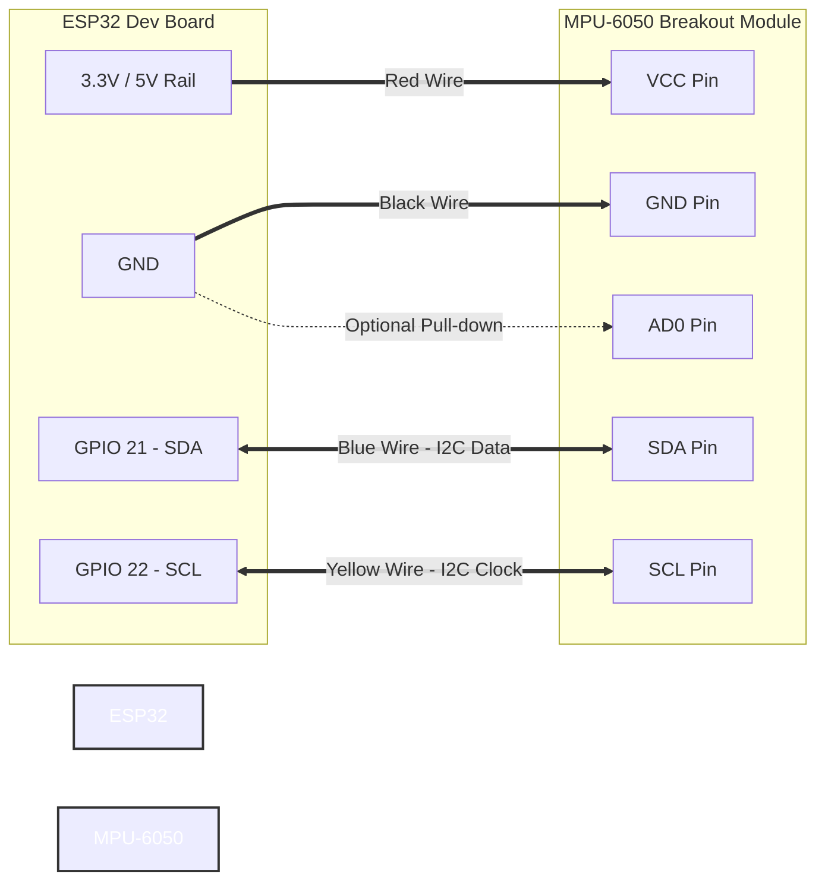

# Hardware Wiring & Pin Configuration

This document provides the complete wiring schematic, pin connection tables, and electrical guidelines for interfacing the **InvenSense MPU-6050** sensor module with the **ESP32 Dev Module**.

---

## Pin Connection Table

| MPU-6050 Pin (GY-521) | ESP32 Dev Board Pin | Signal Type | Electrical Specification | Description |
| :--- | :--- | :--- | :--- | :--- |
| **VCC** | **3.3V** (or **5V / VIN**) | Power Supply | $3.3\text{V} - 5.0\text{V}$ DC | Power supply input to onboard LDO regulator |
| **GND** | **GND** | Power Ground | $0\text{V}$ Reference | Common ground reference |
| **SCL** | **GPIO 22** | I2C Clock | $3.3\text{V}$ Open-drain | Serial Clock line (Hardware I2C0 SCL) |
| **SDA** | **GPIO 21** | I2C Data | $3.3\text{V}$ Open-drain | Serial Data line (Hardware I2C0 SDA) |
| **XDA / XCL** | *No Connection* | Auxiliary I2C | — | Secondary I2C master bus (unused) |
| **AD0** | **GND** (or *Floating*) | Address Select | Logic LOW ($0\text{V}$) | Sets default I2C slave address to `0x68` |
| **INT** | *No Connection* | Interrupt | $3.3\text{V}$ Push-pull / OD | Data Ready interrupt (polling used in firmware) |

---

## Schematic Diagram

---

## Critical Electrical Guidelines

> [!IMPORTANT]
> **1. Logic Level Compatibility**: The ESP32 operates strictly at **$3.3\text{V}$ logic levels**. Feeding $5\text{V}$ signals directly into ESP32 GPIOs can cause permanent damage. While the GY-521 breakout includes an onboard LDO regulator permitting a $5\text{V}$ VCC supply, powering the module directly from the ESP32's **$3.3\text{V}$ pin** ensures safe $3.3\text{V}$ logic levels across SDA and SCL.

> [!TIP]
> **2. I2C Bus Pull-Up Resistors**: The GY-521 breakout board already contains onboard $4.7\text{ k}\Omega$ pull-up resistors on both the SDA and SCL lines tied to the 3.3V rail. External pull-up resistors are **not required**.

> [!CAUTION]
> **3. Wire Length & Noise Immunity**: I2C is designed for short-distance inter-chip communication. When routing cables along a glove to the wrist-mounted ESP32, keep the four-wire harness under **$30\text{ cm}$ ($12\text{ inches}$)** to prevent parasitic capacitance from degrading signal rise times.

---

## Assembly & Testing Checklist

1. [ ] Solder male header pins to the GY-521 module perpendicular to the board.
2. [ ] Connect GND to ESP32 GND and VCC to ESP32 3.3V.
3. [ ] Connect SDA to GPIO 21 and SCL to GPIO 22.
4. [ ] Power the ESP32 via USB and observe the onboard power LED on the GY-521 illuminate solid red.
5. [ ] Upload an I2C scanner sketch or the project firmware ([esp_glove.ino](../firmware/esp_glove/esp_glove.ino)) and verify response at address `0x68`.
